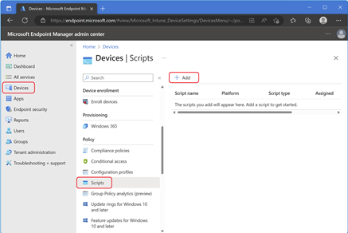
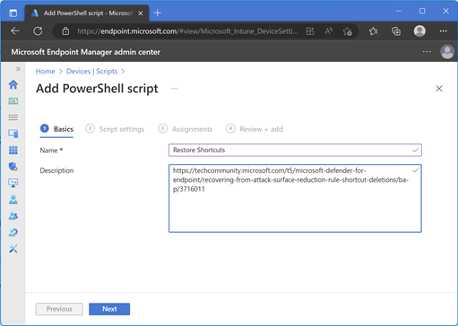
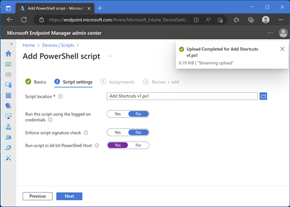
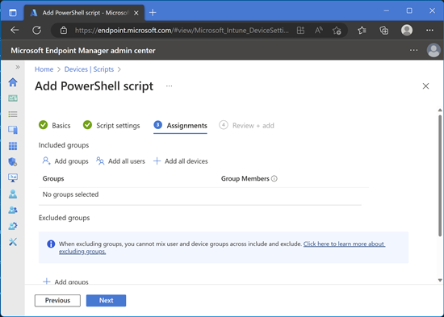
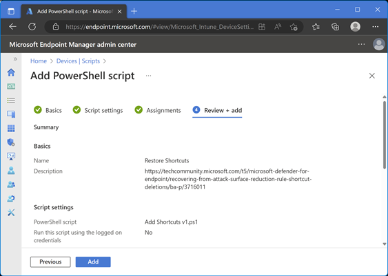
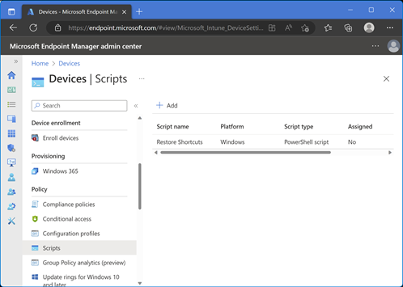
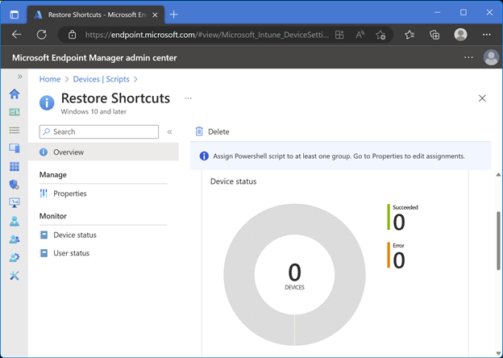

# Step-by-step guide to run PowerShell scripts via Intune on Windows 10/11

This guide visually demonstrates steps described in Microsoft public documentation

[Add PowerShell scripts to Windows 10/11 devices in Microsoft Intune](https://learn.microsoft.com/en-us/mem/intune/apps/intune-management-extension#create-a-script-policy-and-assign-it)

##### 1. Sign in to the [Microsoft Endpoint Manager admin center.](https://go.microsoft.com/fwlink/?linkid=2109431)
##### 2. Select Devices > Scripts > Add > Windows 10 and later. 

##### 3. In **Basics**, enter the following properties, and select Next:
* **Name**: Enter a name for the PowerShell script. 
* **Description**: Enter a description for the PowerShell script. This setting is optional, but recommended. 

##### 4. Specify the script file and configure the settings knobs as shown below 

“Run this script using the logged-on credentials” set it to No 

Note: Device targeting is preferred in case the end users are not logged on. 

##### 5. “Add groups” select an AAD group for script targeting. You may want to select a group of test devices and users.

##### 6. Review all settings and “Add” 

##### 7. Script created. Click on the script to monitor results 

##### 8. Script results can be monitored in detail by browsing to “Device status” 

For additional information and general troubleshooting of running PowerShell scripts via Intune please see product documentation at
[Add PowerShell scripts to Windows 10/11 devices in Microsoft Intune](https://learn.microsoft.com/en-us/mem/intune/apps/intune-management-extension#create-a-script-policy-and-assign-it)
